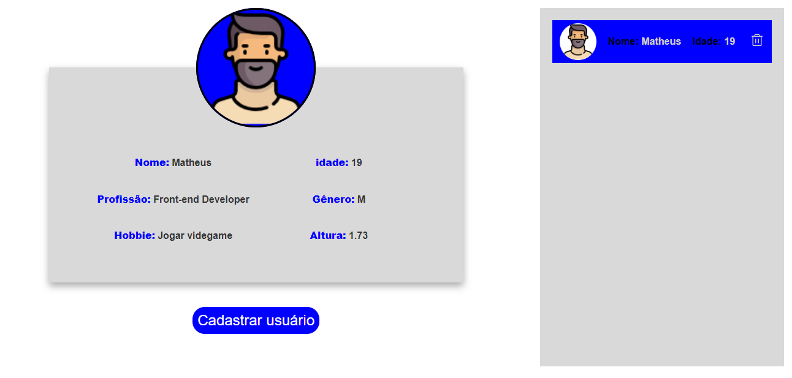

# People Register Sistem

  

  [clique aqui para acessar o projeto do seu navegador](https://people-register-sistem.vercel.app)🔗

Projeto com o intuito de me fazer aprender um pouco mais sobre a API context do react fazendo uso de useContext e createContext, o projeto tambem serviu para solidificar meus estudo sobre LocalStorage, conceito esse que nunca tinha colocado na prática (esse foi o motivo tambem de não ter sido incrementado um banco de dados nesse projeto).

O projeto me ajudou tambem a praticar meus conhecimentos em React.js, styled components e a biblioteca PhosporIcons que fornece icones para a aplicação

## Libs:
* React.js
* styled-components
* phosporIcons
